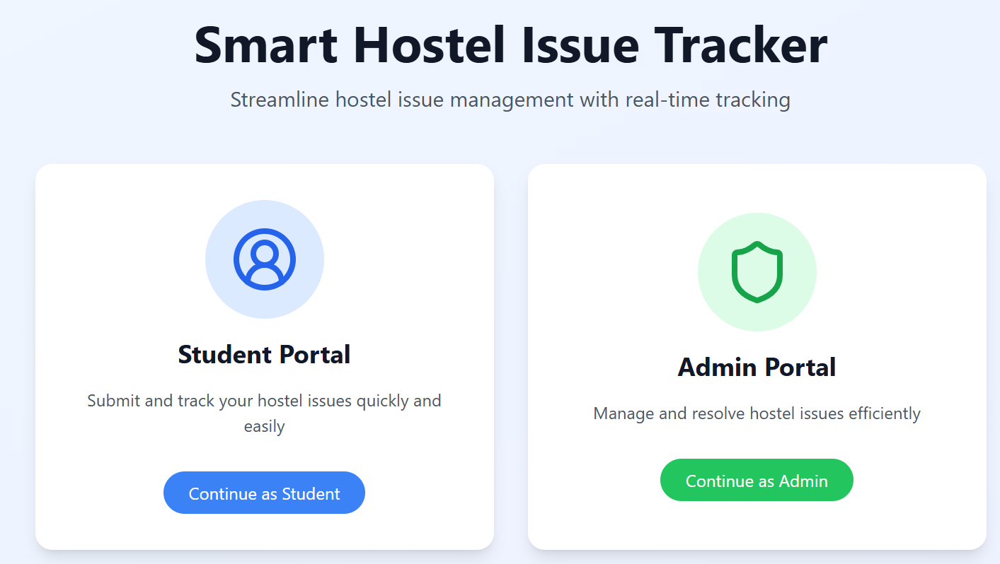
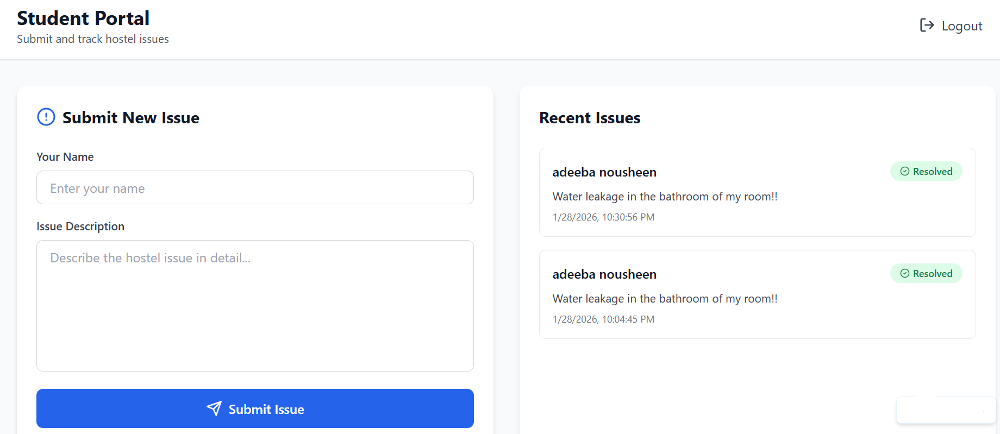
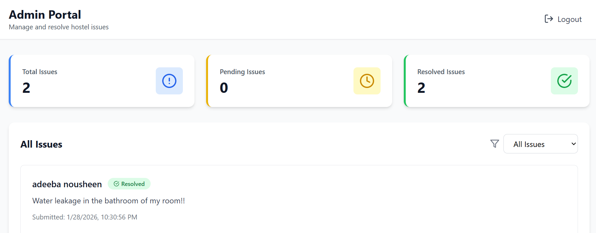

# 🏨 Smart Hostel Issue Tracking System

A full-stack web application to digitally manage hostel complaints, allowing students to submit issues and administrators to track and resolve them efficiently.

## 🚩 Problem Statement
Hostel issues are often handled manually through registers or informal messaging, leading to delays, lack of transparency, and poor tracking.

## 💡 Solution
This system provides a centralized platform where:
- Students can submit hostel-related issues
- Admins can view, filter, and resolve complaints
- Status updates are tracked in real time

## ✨ Features
- Student issue submission
- Admin dashboard with statistics
- Filter issues by status (Pending / Resolved)
- Mark issues as resolved
- Persistent login
- Clean and professional UI

## 🛠 Tech Stack
- React + TypeScript
- Supabase (Backend & Database)
- Bolt.new
- GitHub

## 🚀 Use Cases
- College hostels
- Apartment maintenance
- Campus issue management

## 🔮 Future Enhancements
- Email/SMS notifications
- Issue priority & analytics

- ---

## 👩‍💻 Team Members
- **Adeeba Nousheen** – Frontend development, Supabase integration, deployment
- **Rida Fathima** – Backend support, database design, testing and documentation

## 📸 Application Screenshots

### 🏠 Landing Page

### 🎓 Student Portal

### 🛠️ Admin Portal

- Role-based authentication
- Mobile app version

